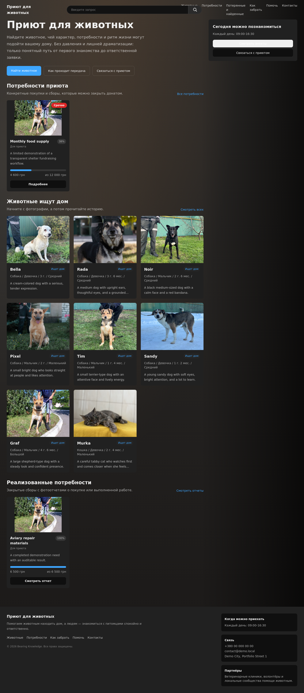
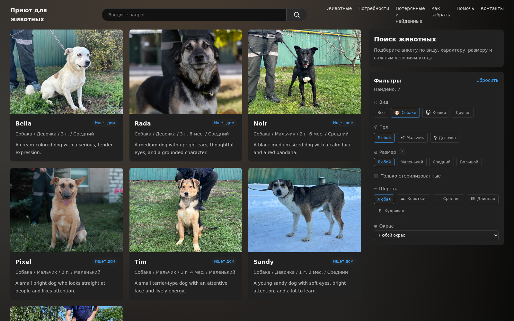
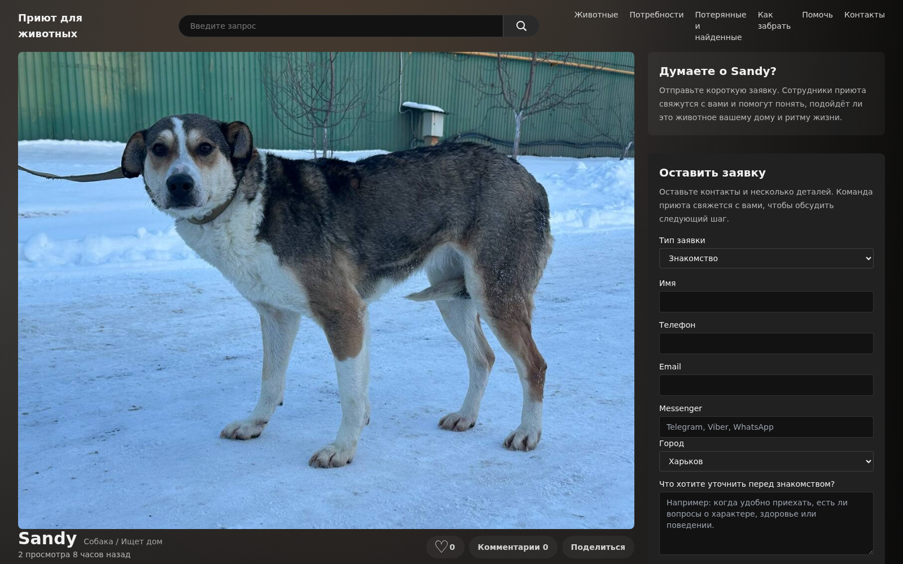
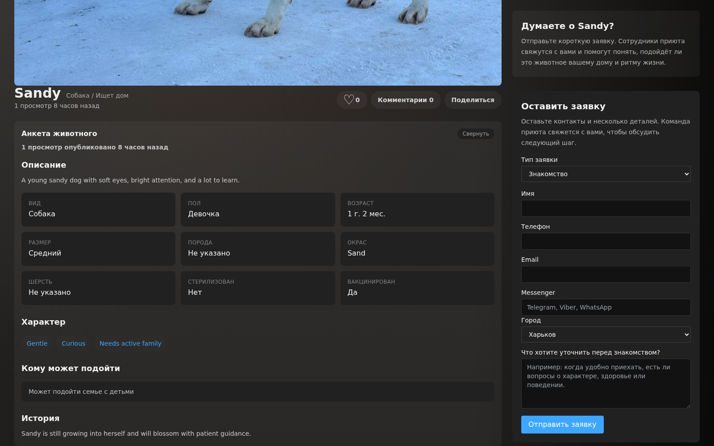
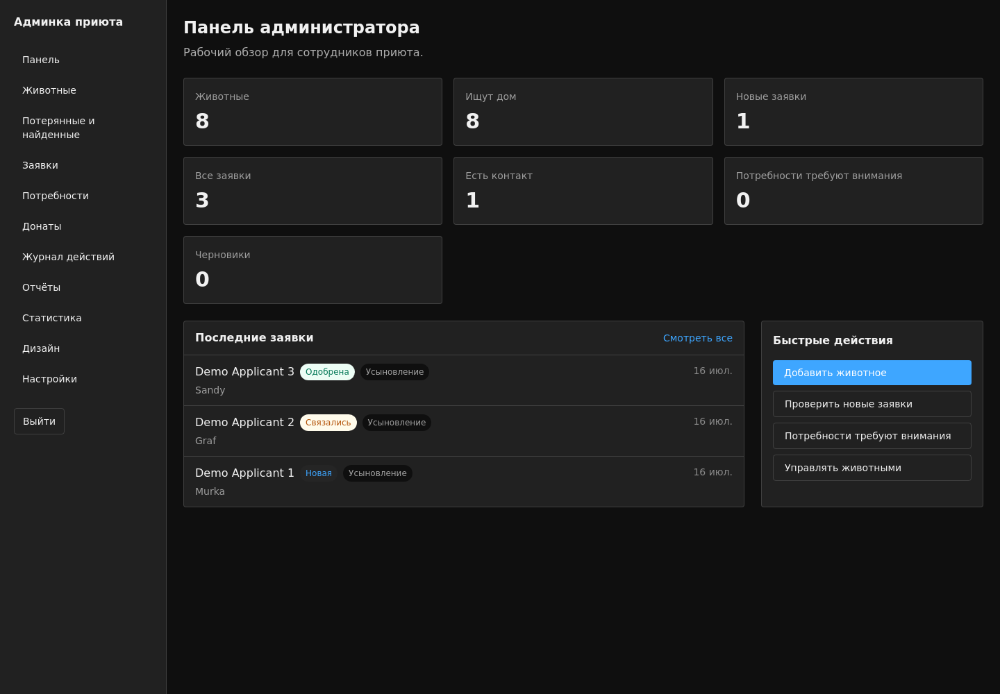
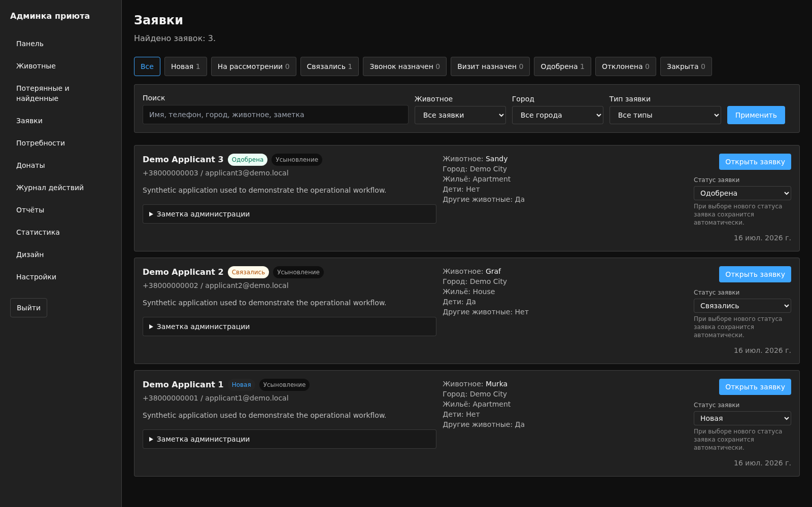

# Animal Shelter Operations Platform

A presentation-ready full-stack platform for animal shelter operations.

The project combines a public adoption portal with an internal workspace for
shelter staff. This is a limited demonstration edition with synthetic records,
local-only credentials, disabled payment processing, and a small media set.

## Product Scope

Public workflows:

- animal catalog, filtering, search, and profile pages;
- adoption and acquaintance applications;
- lost-and-found reports;
- shelter and animal-specific needs;
- donation history in demonstration mode;
- contact and visit information.

Operational workflows:

- role-based administration for staff and administrators;
- animal, application, need, donation, and lost-and-found management;
- application status workflow and internal notes;
- audit history;
- statistics and report export;
- configurable visual themes and public settings.

## Architecture

```text
Next.js UI
  -> Server Actions / Route Handlers
  -> Application Services
  -> Repositories
  -> Prisma
  -> MySQL
```

React components do not access Prisma directly. Request boundaries remain thin,
while business rules live in services and persistence logic lives in
repositories.

## Technology

- Next.js 16 and React 19;
- TypeScript;
- Prisma ORM;
- MySQL 8.4;
- Zod validation;
- Recharts;
- Tailwind CSS;
- Docker and Docker Compose.

## Run The Demo

Requirements:

- Docker;
- Docker Compose.

Start the complete environment:

```bash
docker compose up --build
```

Open:

- application: http://localhost:3100
- admin login: http://localhost:3100/login
- Adminer: http://localhost:8180

Demo accounts:

```text
Administrator
Email: admin@demo.local
Password: DemoAdmin123!

Staff
Email: staff@demo.local
Password: DemoStaff123!
```

The application container automatically applies Prisma migrations, creates the
limited demonstration dataset when required, and starts the production Next.js
server.

Stop the environment:

```bash
docker compose down
```

Remove the local demo database as well:

```bash
docker compose down -v
```

## Demo Boundaries

This edition intentionally excludes:

- production or shelter databases;
- incoming documents and backups;
- private environment files;
- real payment credentials;
- the full working media archive;
- repository history from the original development workspace.

Payment provider adapters remain visible as architecture examples, but public
payments are disabled in the demo dataset.

## Verification

After the environment is running:

```bash
docker compose exec app npm run typecheck
docker compose exec app npm run smoke
```

The smoke suite covers public APIs, animal management, adoption applications,
file upload, and lost-and-found submission.

## Screenshots

Public portal:



Animal search and filtering:



Animal profile and adoption application:



Expanded animal details:



Administrator dashboard:



Application management:



## Portfolio Context

This project demonstrates end-to-end product development, business-domain
modeling, layered full-stack architecture, authentication and RBAC,
operational workflow design, auditability, relational schema evolution, and
reproducible containerized delivery.

The full development workspace is maintained separately. This repository is
the intentionally bounded public demonstration.
