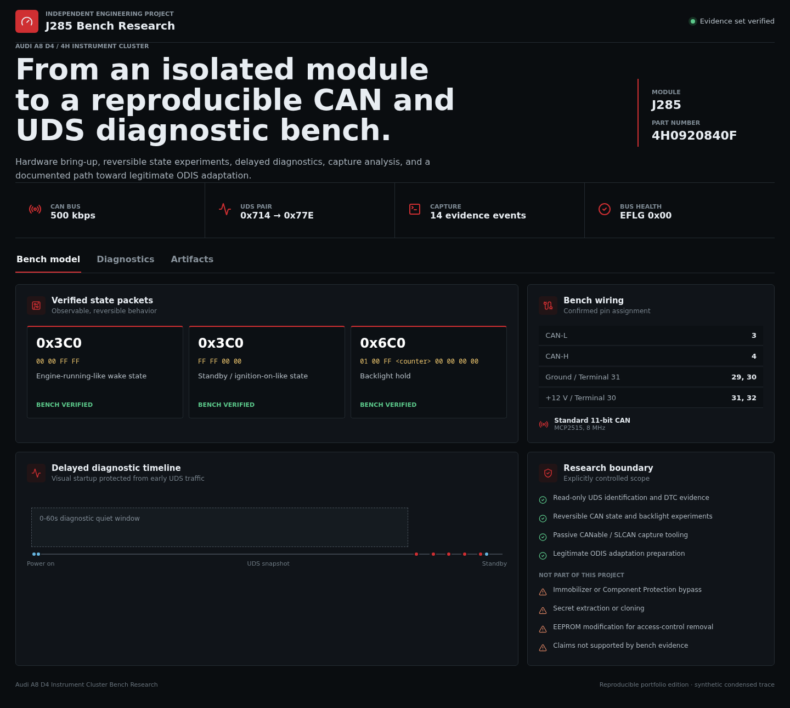
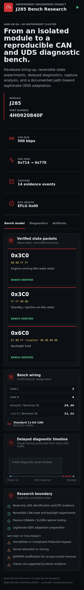

# Audi A8 D4 Instrument Cluster Bench Research

A bounded, reproducible presentation edition of an independent automotive
electronics research project.

The project documents the engineering path from powering an isolated Audi A8
D4 / 4H instrument cluster to controlling verified CAN states, identifying the
J285 module through UDS, and collecting stable read-only diagnostic evidence.

## Demonstrated Result

```text
bench wiring
  -> CAN state discovery
  -> controlled visual reactions
  -> delayed read-only diagnostics
  -> stable DTC evidence
  -> legitimate adaptation plan
```

Verified target:

```text
Module: J285 instrument cluster
Part number: 4H0920840F
CAN: 500 kbps, standard 11-bit
UDS: 0x714 request -> 0x77E response
```

## Selected Findings

- `0x3C0#0000FFFF` produces an engine-running-like wake state.
- `0x3C0#FFFF0000` produces a standby / ignition-on-like state.
- `0x6C0#0100FF<counter>00000000` holds the cluster backlight.
- DID `F187` returns part number `4H0920840F`.
- Delaying UDS traffic for 60 seconds improves visual startup stability.
- Filtered read-only DTC forensics completed with `txFail=0`, `EFLG=0x00`,
  `TEC=0`, `REC=0`, and no negative responses.
- DTC `EA6100/09` was classified as Component Protection active.

The project does not claim to remove or bypass Component Protection. The
documented next step is legitimate adaptation through ODIS with appropriate
authorization.

## Included Artifacts

```text
firmware/
  audia8_cluster_3c0_key_matrix.ino
  audia8_cluster_safe_timeline_context_hold_v7.ino
  audia8_cluster_dtc_forensics.ino
  audia8_cluster_system_emulator_probe.ino

tools/
  can_log_analyzer.py
  slcan_probe.py
  serial_logger.py

evidence/
  demo_capture.log
```

The evidence trace is deliberately compact and public-safe. It is derived from
verified bench results and is not presented as a complete raw vehicle capture.

## Technology

- Arduino and C++;
- MCP2515 CAN controller;
- CANable / SLCAN tooling;
- Python capture and analysis tools;
- UDS diagnostics;
- Flask and Gunicorn;
- React, TypeScript, and Vite;
- Docker and Docker Compose.

## Run

```bash
docker compose up --build
```

Open the research workspace:

- http://localhost:3300

Stop:

```bash
docker compose down
```

## Analyze Evidence

```bash
python3 api/analyze_capture.py evidence/demo_capture.log
```

The parser returns structured events, observed identifiers, DTC classifications,
and final bus-health counters.

## Verify

With the application running:

```bash
python3 api/smoke.py
```

The smoke check verifies:

- application and API health;
- target part number;
- confirmed UDS request/response identifiers;
- presence of the `EA6100` diagnostic record;
- clean final CAN controller counters;
- selected firmware and tooling inventory.

## Screenshots

Desktop research workspace:



Responsive mobile view:



## Bench Wiring

| Signal | Cluster pin |
| --- | --- |
| CAN-L | 3 |
| CAN-H | 4 |
| Ground / Terminal 31 | 29 and 30 |
| +12 V / Terminal 30 | 31 and 32 |

Use suitable current limiting, correct grounding, and an isolated bench setup.
Do not connect active transmit experiments to a live vehicle without a
separately reviewed procedure.

## Public Scope

This edition intentionally excludes:

- full raw captures;
- private working notes and large diagnostic source archives;
- vehicle identifiers and credentials;
- secret extraction or cloning research;
- immobilizer or Component Protection bypass procedures;
- unverified CAN hypotheses.

## Portfolio Context

This project demonstrates:

- technical discovery in an unfamiliar hardware domain;
- physical bench setup and iterative fault isolation;
- embedded C++ and CAN controller work;
- evidence-driven reverse engineering;
- UDS diagnostics and protocol analysis;
- Python capture tooling;
- careful separation of verified facts from hypotheses;
- responsible engineering boundaries;
- packaging a large research workspace as a reproducible public demonstration.
