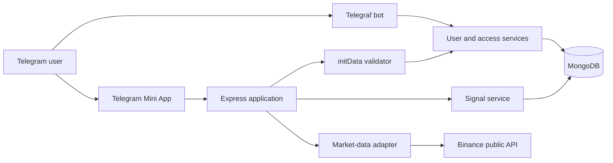

# Architecture

## Context

Bawsaq is an experimental market assistant delivered through Telegram. The
current system supports authenticated information and signal workflows. Its
architecture leaves room for future trading execution without coupling that
future capability directly to the user interface.

## Runtime Components



## Layer Responsibilities

### Interface

- Telegraf commands and callback actions;
- Mini App HTTP routes;
- user and administrator controllers;
- browser-side Mini App assets.

### Application

- market-data normalization;
- user access workflow;
- signal validation and state transitions;
- dashboard composition.

### Infrastructure

- MongoDB connection and Mongoose models;
- Telegram bot construction;
- Dockerized runtime.

### Utilities

- Telegram message update helpers;
- Telegram Mini App HMAC verification.

## Trust Boundaries

### Telegram To Server

Telegram `initData` is untrusted until its hash and age are verified on the
server. A client-provided Telegram ID alone is not accepted as identity.

### User To Administrator

Approved user access and administrator privileges are separate decisions.
Administrator endpoints require a validated Telegram session and an
administrator role.

### Information To Execution

Market information and trade signals do not imply permission to execute a
financial transaction. A future executor requires a separate capability,
policy, credential, idempotency, reconciliation, and audit boundary.

## Domain State Machines

### User Access

```text
new
  -> pending
       -> approved
       -> rejected
```

### Trade Signal

```text
draft
  -> active
       -> closed
       -> canceled
  -> canceled
```

The application service owns transition rules so controllers do not mutate
states ad hoc.

## Future Execution Boundary

A safe execution layer would sit behind the signal workflow:

```text
published signal
-> strategy/risk policy
-> paper or live execution command
-> exchange adapter
-> order acknowledgement
-> reconciliation
-> portfolio state
-> audit event
```

This layer is intentionally described as future architecture. It is not
implemented or simulated in the public snapshot.
