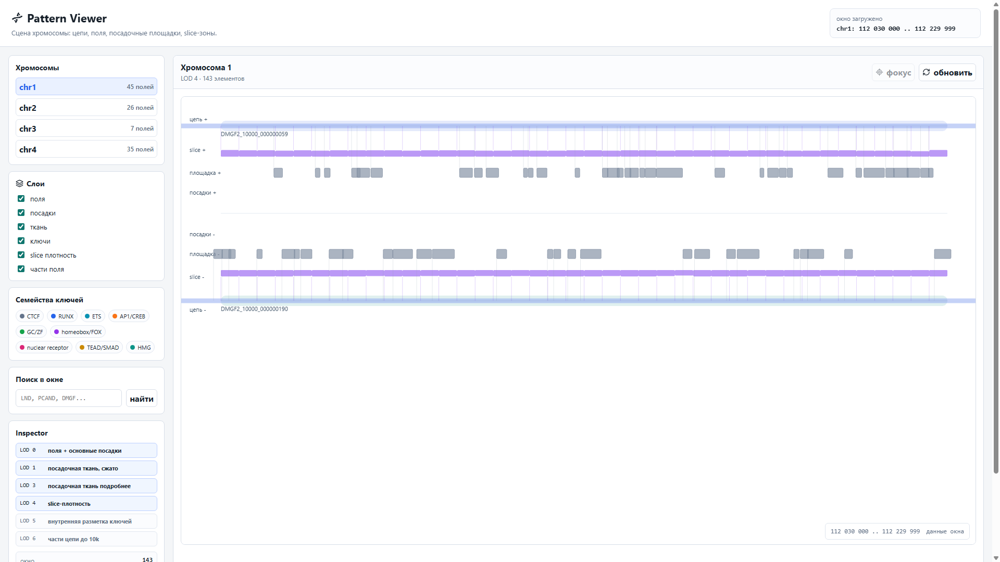
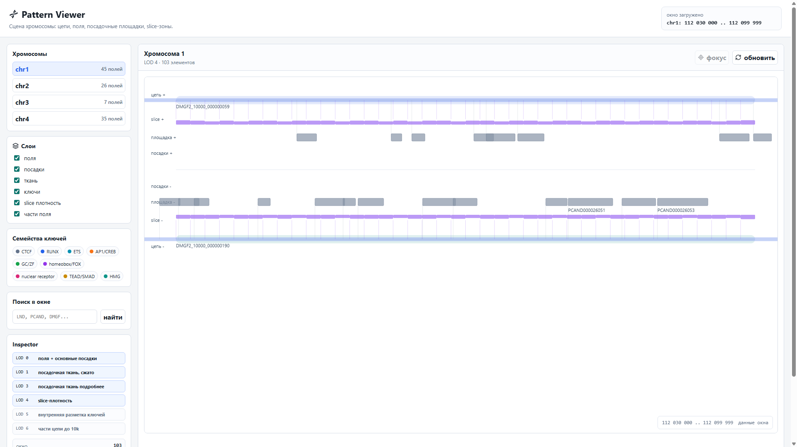
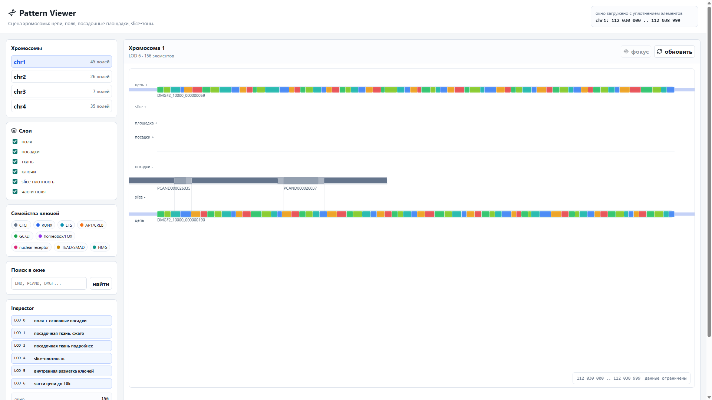

# Pattern DNA Research Platform

An independent computational genomics research and software-engineering
project for exploring DNA regulatory architecture, contextual genomic roles,
transcription-factor key families, landing platforms, pre-mRNA fields and
candidate assembly routes.

The small Docker demonstration in this repository is only a reproducible
example. The original research environment is substantially larger and
contains real reference datasets, derived multi-gigabyte tables, hundreds of
analysis scripts, a PostgreSQL research model and a PixiJS chromosome viewer.

## Project Separation

The real work is divided into two connected workspaces:

```text
DNA
  public reference data
  raw and derived research files
  repeatable scientific analysis scripts
  manifests and research logs

Pattern
  PostgreSQL model
  import and examination pipelines
  run and provenance registry
  contextual role resolver
  chromosome viewer
  metrics and research dashboards
```

The split is deliberate:

```text
DNA     = research computation and derived evidence
Pattern = structured model, infrastructure, rules, exams and visualization
```

## Real Scale

Measured from the current local working environment:

| Area | Current scale |
| --- | ---: |
| Pattern infrastructure workspace | approximately `5.0 GB` |
| DNA reference/research workspace | approximately `5.5 GB` |
| Mounted read-only research storage | approximately `143 GB` |
| PostgreSQL tables | `44` |
| Estimated PostgreSQL rows | approximately `7.27 million` |
| Pattern pipeline/report scripts | `175` |
| DNA analysis scripts | `126` |
| Pattern result and documentation files | `396` |
| DNA data files | `255` |

Selected large derived outputs:

| Dataset | Approximate size |
| --- | ---: |
| ENCODE SCREEN cCRE-to-gene links | `3.6 GB` |
| Landing key-family window roles | `1.2 GB` |
| Chain-specific landing-family windows | `1.0 GB` |
| chr1 semantic strong slice sites | `656 MB` |
| Landing key-family windows | `406 MB` |
| chr1-4 CTCF directed profile | `387 MB` |
| Pol II minus-chain post-end segments | `250 MB` |

These values explain why the public demo uses a tiny synthetic dataset. The
demo is an architectural sample, not the complete research database.

## Public Reference Sources

The DNA workspace organizes public biological sources including:

- Ensembl GRCh38 release 115 chromosome FASTA files;
- Ensembl gene and regulatory annotations;
- JASPAR and HOCOMOCO motif databases;
- human oocyte and early-embryo expression data;
- ENCODE SCREEN cCRE and 3D contact evidence;
- derived motif, enhancer, promoter, field and candidate-route tables.

The project-specific work is the organization, analysis pipeline, modeling,
derived evidence and interpretation layer built above those public sources.

## Research Question

Conventional annotation describes genes, exons, introns and regulatory
features. This project investigates a different engineering representation:

- retain genomic objects independently from their possible roles;
- represent role as context-dependent;
- model reading modes explicitly;
- connect landing platforms, key families and Pol II complexes;
- preserve competing hypotheses and incomplete evidence;
- test candidate structures against known annotations.

The central modeling rule is:

```text
object separately
role separately
mode separately
complex separately
result separately
```

A genomic region is not permanently collapsed into one label. The same region
may participate differently under another reading mode or evidence context.

## Architecture

```text
public genomic references
  -> local DNA workspace
  -> sequence and annotation scans
  -> multi-gigabyte derived TSV layers
  -> inventory and provenance manifests
  -> PostgreSQL imports
  -> contextual roles and reading modes
  -> exams against known genes and annotations
  -> chromosome viewer and research dashboards
```

### Research Pipeline

The pipeline includes stages for:

- field construction;
- landing-platform analysis;
- cut-site and slice-zone analysis;
- chain assignment;
- key-family semantic layers;
- enhancer/promoter relationships;
- CTCF geometry;
- Mediator structural references;
- pre-mRNA construction;
- mature-pattern exams;
- error audits and hypothesis repair.

### Database

The PostgreSQL schema uses relational genomic coordinates and references where
the structure is stable, while evolving evidence and mechanics may use JSONB.

Large current tables include:

| Table | Approximate rows |
| --- | ---: |
| `chain_specific_landing_family_windows` | `2,424,251` |
| `slice_zones` | `1,703,762` |
| `landing_key_family_windows` | `1,611,165` |
| `regions` | `1,331,278` |
| `landing_key_family_summary` | `190,265` |
| `pol2_landing_complex_members` | `8,729` |
| `pol2_landing_complexes` | `2,269` |

The selected real schema is included at
[original-project/db/001_schema.sql](original-project/db/001_schema.sql).

### Contextual Role Resolver

The resolver answers questions such as:

```text
given landing platforms, key families and a reading context:
  what role may each platform take?
  what evidence is missing?
  can a pair assemble into an address-landing complex?
```

Selected real implementation files:

- [models.py](original-project/role_resolver/models.py);
- [resolver.py](original-project/role_resolver/resolver.py);
- [signatures.py](original-project/role_resolver/signatures.py).

### Pipeline Infrastructure

Selected real files:

- [CLI](original-project/architecture_pipeline/cli.py);
- [inventory](original-project/architecture_pipeline/inventory.py);
- [manifest](original-project/architecture_pipeline/manifest.py);
- [path model](original-project/architecture_pipeline/paths.py);
- [Docker Compose](original-project/docker-compose.yml);
- [viewer package](original-project/viewer/package.json).

## Real Viewer

The original viewer is a React, TypeScript and PixiJS application. It supports:

- chromosomes 1-4 in the current imported model;
- genomic window navigation;
- search by research object identifier;
- selectable semantic layers;
- key-family filtering;
- plus/minus chain visualization;
- object inspection;
- level-of-detail transitions from field overview to internal pattern parts.

LOD levels allow millions of database objects to be inspected without drawing
every low-level feature at chromosome scale.

### chr1 — 200 kb Overview



At this scale the viewer emphasizes broad fields and landing-platform
distribution.

### chr1 — 70 kb Window



The narrower window exposes more local placement structure while retaining
field context.

### chr1 — 9 kb Detail, LOD 6



At high detail the viewer reveals internal field parts, chain structure and
local platform relationships.

The real viewer currently runs from the original workspace at:

```text
http://localhost:5173
```

## Engineering Conclusions

### 1. Fixed Biological Labels Were Not Sufficient

A schema that permanently stores every region as one fixed role loses the
ability to represent context-dependent hypotheses. Object identity and role
needed separate persistence.

### 2. Research Required Multiple Storage Forms

Large sequential scans and intermediate products are efficient as files.
Connected, queryable objects and evidence are more useful in PostgreSQL.
The project therefore uses both file pipelines and relational storage.

### 3. Level of Detail Is an Architectural Requirement

Millions of genomic records cannot be rendered directly at every scale. The
viewer requires LOD-aware queries and rendering strategies, not only frontend
styling.

### 4. Negative Results Are Research Artifacts

Failed exams, unresolved routes and mismatch audits are preserved. They guide
the next hypothesis instead of being discarded as unsuccessful output.

### 5. Provenance Must Survive Iteration

The model evolves through many scans and repair attempts. Inventories,
manifests, run metadata and explicit result files are required to know which
evidence produced a conclusion.

## Technology

- Python scientific and ETL scripts;
- C++ accelerated scanning utilities;
- PostgreSQL 16;
- relational coordinates and JSONB evidence;
- Flask research dashboards;
- React 18 and TypeScript;
- PixiJS genomic visualization;
- JBrowse proof-of-concept;
- Docker and Docker Compose;
- large TSV/FASTA/GFF3 processing.

## Reproducible Public Demo

The smaller presentation environment remains available:

```bash
docker compose up --build
```

- compact viewer: http://localhost:3200
- Adminer: http://localhost:8281

It demonstrates the database and contextual-role architecture on synthetic
data. It must not be interpreted as the complete project.

## Scientific Boundary

This is independent computational research and software experimentation.

The project demonstrates:

- engineering methods;
- data organization;
- hypothesis representation;
- repeatable analysis;
- visualization and examination tooling.

The evolving biological interpretations are not presented as peer-reviewed
discoveries or medical conclusions.

## Portfolio Context

Pattern DNA demonstrates:

- entry into an unfamiliar scientific domain;
- processing very large public datasets;
- hundreds of repeatable analysis programs;
- mixed file/relational data architecture;
- flexible modeling for incomplete knowledge;
- scientific provenance and error analysis;
- high-performance visualization;
- infrastructure and full-stack delivery;
- the ability to turn a large experimental workspace into an inspectable
  research platform.

